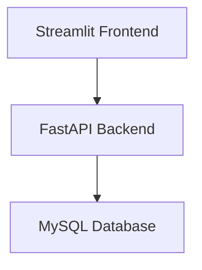
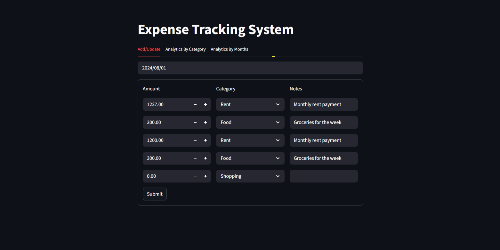
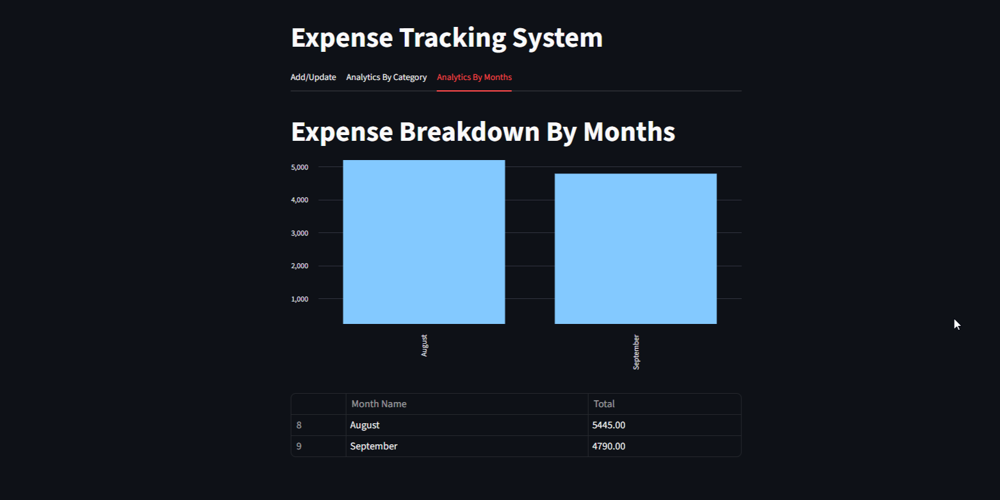
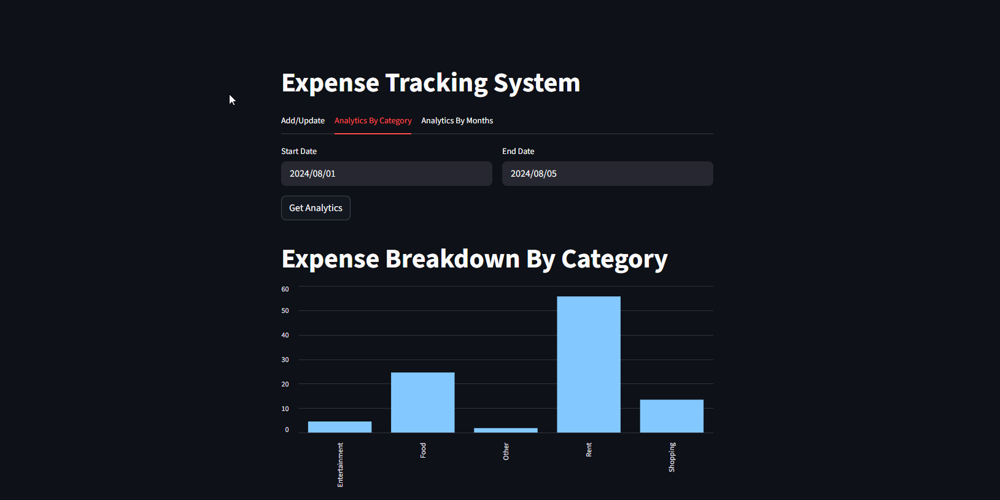

<div align="center">

# Expense Tracking Analytics System

Full-stack analytics application for expense management, financial tracking, and interactive dashboard reporting using Python technologies.

[](https://expense-tracking-analytics.streamlit.app/)


</div>

---

# Project Overview

This project was developed to demonstrate end-to-end analytics application development using Python, FastAPI, Streamlit, and MySQL.

The system allows users to:

- Add and update expense records
- Analyze monthly spending trends
- Visualize category-level financial insights
- Interact with dashboards through a Streamlit frontend
- Process and manage data through FastAPI REST APIs

The application follows a backend/frontend architecture and integrates a MySQL database for persistent storage.

---

# Features

- Expense add & update functionality
- FastAPI backend architecture
- Streamlit interactive frontend
- REST API integration
- Monthly expense analytics
- Category-based spending analysis
- MySQL database connectivity
- Interactive charts and visualizations
- Backend logging system
- Environment variable configuration

---

# Tech Stack

## Backend
- Python
- FastAPI
- MySQL
- REST APIs

## Frontend
- Streamlit
- Pandas

## Additional Tools
- Requests Library
- Python Dotenv
- Logging

---

# Project Structure

```txt
expense-tracking-analytics-system/
│
├── backend/
│   ├── db_helper.py
│   ├── logging_setup.py
│   └── server.py
│
├── data/
│   └── sample_expenses.csv
│
├── frontend/
│   ├── add_update.py
│   ├── analytics_by_category.py
│   ├── analytics_by_months.py
│   ├── app.py
│   │
│   └── api_version/
│       ├── add_update_api.py
│       ├── analytics_by_category_api.py
│       └── analytics_by_months_api.py
│
├── screenshots/
│   ├── dashboard_overview.png
│   ├── monthly_analytics.png
│   └── category_analysis.png
│
├── tests/
│   ├── backend/
│   ├── frontend/
│   └── conftest.py
│
├── .env.example
├── .gitignore
├── README.md
└── requirements.txt
```

---

# System Architecture



---

# Project Screenshots

## Dashboard Overview


---

## Monthly Analytics


---

## Category Analysis


---

# Skills Demonstrated

- Backend API Development
- Data Analytics Workflows
- REST API Integration
- Database Management
- Frontend Dashboard Development
- Financial Data Analysis
- Python Application Development
- Data Visualization
- Client-Server Architecture
- Environment Variable Management

---

# How to Run the Project

## 1. Clone Repository

```bash
git clone https://github.com/yahya-slmn/expense-tracking-analytics-system.git
```

---

## 2. Navigate to Project

```bash
cd expense-tracking-analytics-system
```

---

## 3. Install Requirements

```bash
pip install -r requirements.txt
```

---

## 4. Configure Environment Variables

Create a `.env` file using the `.env.example` template.

Example:

```env
DB_HOST=localhost
DB_USER=your_username
DB_PASSWORD=your_password
DB_NAME=expense_manager
```

---

## 5. Run FastAPI Backend

```bash
uvicorn backend.server:app --reload
```

Backend will run on:

```txt
http://127.0.0.1:8000
```

---

## 6. Run Streamlit Frontend

```bash
streamlit run frontend/app.py
```

Frontend will run on:

```txt
http://localhost:8501
```

---

# API Workflow

The application uses FastAPI REST endpoints to:

- Retrieve expense data
- Update expense records
- Process monthly analytics
- Generate category-level summaries

The Streamlit frontend communicates with the backend using Python requests.

---

# Future Improvements

- User authentication & authorization
- Cloud database deployment
- Docker containerization
- AI-powered spending insights
- Budget forecasting & anomaly detection
- Exportable PDF financial reports
- Role-based dashboard access
- Real-time analytics monitoring

---

# Live Demo Note

The live Streamlit demo uses sample CSV data for public portfolio viewing.

The repository also includes the original FastAPI backend and MySQL integration to demonstrate the full-stack architecture used in local development.

---

# Connect With Me

- LinkedIn: https://www.linkedin.com/in/yahya-sleiman-6b742a356
- Portfolio: YOUR_PORTFOLIO_URL
- GitHub: https://github.com/yahya-slmn

---

# Author

## Yahya Sleiman

Data Analyst | BI Developer | Python Analytics Enthusiast

---

# Repository Notes

This repository is intended for educational and portfolio purposes.

Sensitive configuration data such as database credentials are managed securely using environment variables and are not included in this repository.
